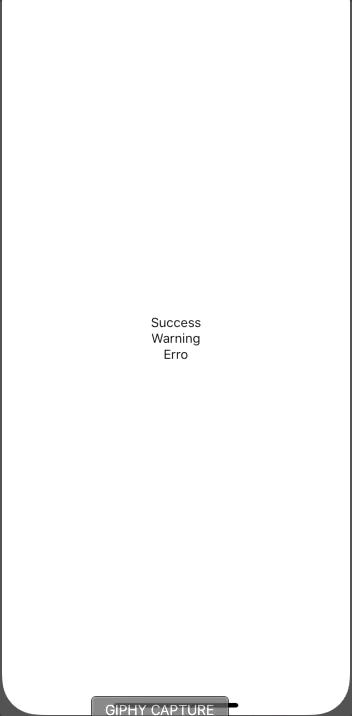
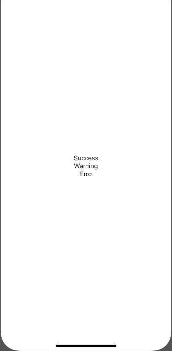

# react-native-popup-ui

A simple and fully customizable React Native component that implements a popup UI.

- Easy to customize, has prop to change background color
- Function to close automatically
- Receives callback prop to set button action

|                          Example One                          |                          Example Two                          |                         Example Three                         |
| :-----------------------------------------------------------: | :-----------------------------------------------------------: | :-----------------------------------------------------------: |
|  [examples/App.js](examples/App.js) |  [examples/App.js](examples/App.js) |  [examples/App.js](examples/App.js) |

## Installation

If using yarn:

```
yarn add popup-ui
```

If using npm:

```
npm i popup-ui
```

## Usage

```
import { View, TouchableOpacity, Text } from 'react-native'
import { Root, Popup } from 'popup-ui'
```

Simply declare the method in your event `Popup.show({...})` in its component.

```
<Root>
    <View>
        <TouchableOpacity
            onPress={() =>
              Popup.show({
                type: 'Success',
                title: 'Upload complete',
                button: false,
                textBody: 'Congrats! Your upload successfully done',
                buttontext: 'Ok',
                callback: () => Popup.hide()
              })
            }
        >
            <Text>Open Popup</Text>
        </TouchableOpacity>
    </View>
</Root>
```

### Popup Type Usage

Popup contains a type-customization scheme `Type` props.

Example success usage:

```
Popup.show({
    type: 'Success'
})
```

Example warning usage:

```
Popup.show({
    type: 'Warning'
})
```

Example error usage:

```
Popup.show({
    type: 'Danger'
})
```

### Popup Style Background

Popup contains a customization in `Background` props.

Example usage:

```
Popup.show({
    background: 'red'
})
```

### Popup Callback Function

Popup contains a callback function in button popup `Callback` props.

Example usage:

```
Popup.show({
    callback: Popup.hide()
})
```

## Documentation

### Popup Component

| Name       | Description                                     | Default            | Type   |
| ---------- | ----------------------------------------------- | ------------------ | ------ |
| title      | Sets the main popup title                       | Upload complete    | String |
| type       | Defines the type (Success, Warning or Error)    | Success            | String |
| textBody   | Defines the text body of popup                  |                    | String |
| button     | Whether or not to display the                   | true               | Bool   |
| buttonText | Defines the text button of popup                | Ok                 | String |
| callback   | Defines the function of button                  | Alert()            | Func   |
| background | Sets the backgroundColor                        | rgba(0, 0, 0, 0.5) | String |
| timing     | Sets the time for the popup to close by itself  | 5000               | Number |
| autoclose  | sets whether the popup will close automatically | false              | Bool   |

## Contributing

Pull requests are always welcome! Feel free to open a new GitHub issue for any changes that can be made.

## Author

Rafael Augusto | [https://linkedin.com/in/rafaelaugustos/](https://linkedin.com/in/rafaelaugustos/)

## Roadmap
- Toast
- Alert/Confirm


## License

[MIT](./LICENSE)
